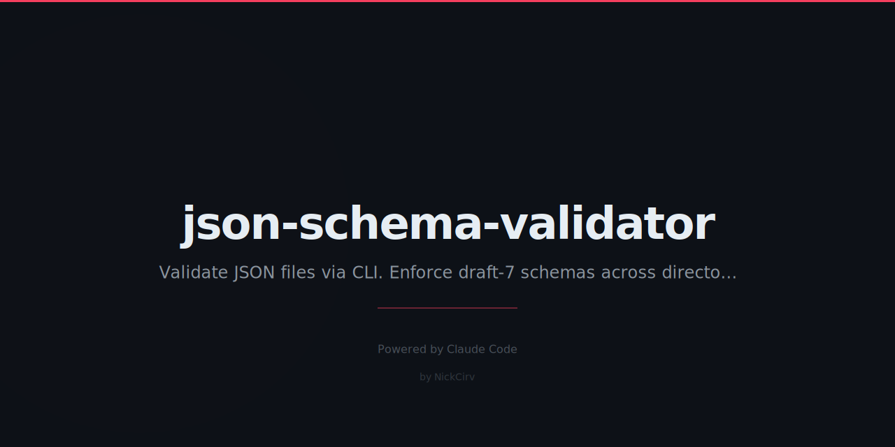

# json-schema-validator

CLI JSON Schema validator (draft-7). Pure JavaScript — zero external dependencies. Validate files, directories, or use watch mode.

## Install

```bash
npm install -g json-schema-validator
```

Or run without installing:

```bash
npx json-schema-validator schema.json data.json
```

## Usage

```bash
jsv <schema.json> <data.json>          # Validate a single file
jsv <schema.json> <dir/>               # Validate all .json files in directory
jsv <schema.json> *.json               # Glob support
jsv <schema.json> a.json b.json        # Multiple files
```

## Options

| Flag | Description |
|------|-------------|
| `--watch` | Watch for file changes and re-validate |
| `--json` | Output results as JSON (CI-friendly) |
| `--coerce` | Attempt type coercion before failing (e.g. `"42"` → `42`) |
| `--errors-only` | Suppress output for valid files |
| `--help` | Show help |

## Exit Codes

| Code | Meaning |
|------|---------|
| `0` | All files valid |
| `1` | One or more validation errors |
| `2` | Schema or JSON parse error |

## Examples

```bash
# Validate a single file
jsv schema.json data.json

# Validate all JSON files in a directory
jsv schema.json ./fixtures/

# CI pipeline — JSON output, errors only
jsv schema.json dist/*.json --json --errors-only

# Coerce string numbers to numbers
jsv schema.json data.json --coerce

# Watch mode during development
jsv schema.json data.json --watch
```

### JSON Output (--json)

```json
[
  {
    "file": "data.json",
    "status": "invalid",
    "errors": [
      {
        "path": "data.users[0].email",
        "message": "must be a valid email format"
      }
    ]
  }
]
```

## Supported Keywords

### Types
`string` `number` `integer` `boolean` `array` `object` `null`

### String
`minLength` `maxLength` `pattern` `format`

**Formats:** `email` `uri` `date` `date-time` `uuid` `ipv4` `ipv6` `hostname`

### Number / Integer
`minimum` `maximum` `exclusiveMinimum` `exclusiveMaximum` `multipleOf`

### Array
`items` `additionalItems` `minItems` `maxItems` `uniqueItems` `contains`

### Object
`properties` `required` `additionalProperties` `patternProperties` `minProperties` `maxProperties` `dependencies`

### Combining Schemas
`allOf` `anyOf` `oneOf` `not` `if` / `then` / `else`

### References
`$ref` — local `$defs` and `definitions` only (no external URIs)

### Other
`enum` `const`

## Example Schema

```json
{
  "$schema": "http://json-schema.org/draft-07/schema#",
  "type": "object",
  "required": ["id", "name", "email"],
  "properties": {
    "id":    { "type": "integer", "minimum": 1 },
    "name":  { "type": "string", "minLength": 2 },
    "email": { "type": "string", "format": "email" },
    "role":  { "type": "string", "enum": ["admin", "user", "guest"] },
    "tags":  { "type": "array", "items": { "type": "string" }, "uniqueItems": true }
  },
  "additionalProperties": false
}
```

## Security

- Zero external npm dependencies — built-in Node.js modules only (`fs`, `path`, `readline`, `child_process`)
- No eval, no dynamic requires
- All file I/O is explicit and sandboxed to provided paths
- Safe for use in CI/CD pipelines

## Requirements

Node.js >= 18

## License

MIT
